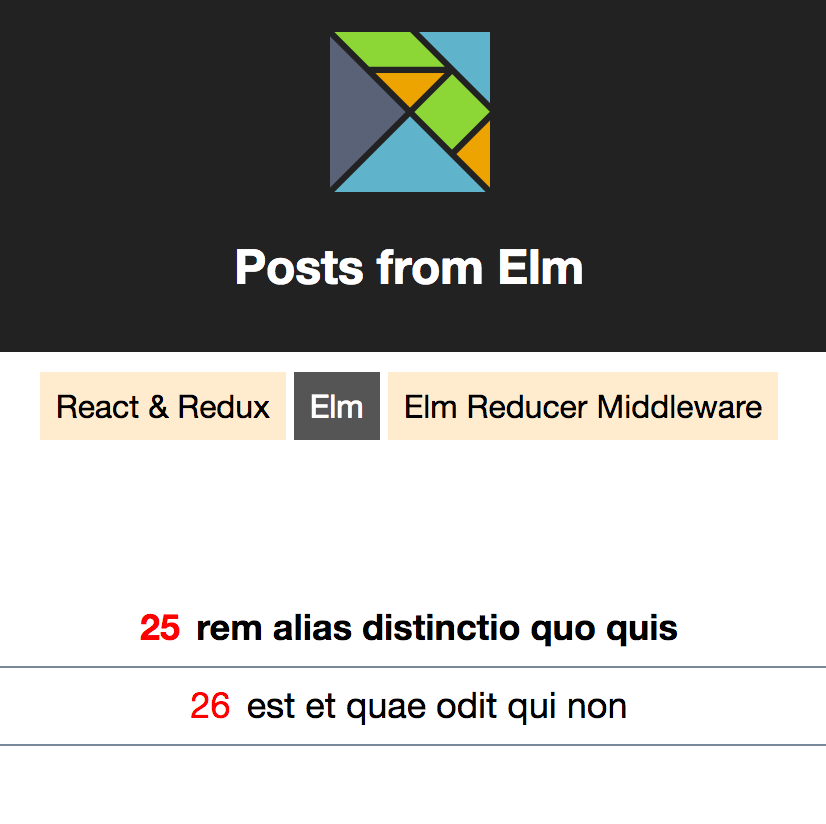

# elm-and-react

Some ways of integrating Elm with React & Redux, all in one app. [Demo](https://zaboco.github.io/elm-and-react/)

#### React & Redux
- React components
- Redux actions, reducer and container

#### Elm
- Full Elm app, included as a [React component](https://github.com/evancz/react-elm-components)

#### Elm reducer middleware
- React components
- Init / Update logic in Elm
- Communicating via [redux-elm-middleware](https://github.com/stoeffel/redux-elm-middleware)
